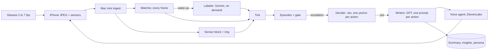
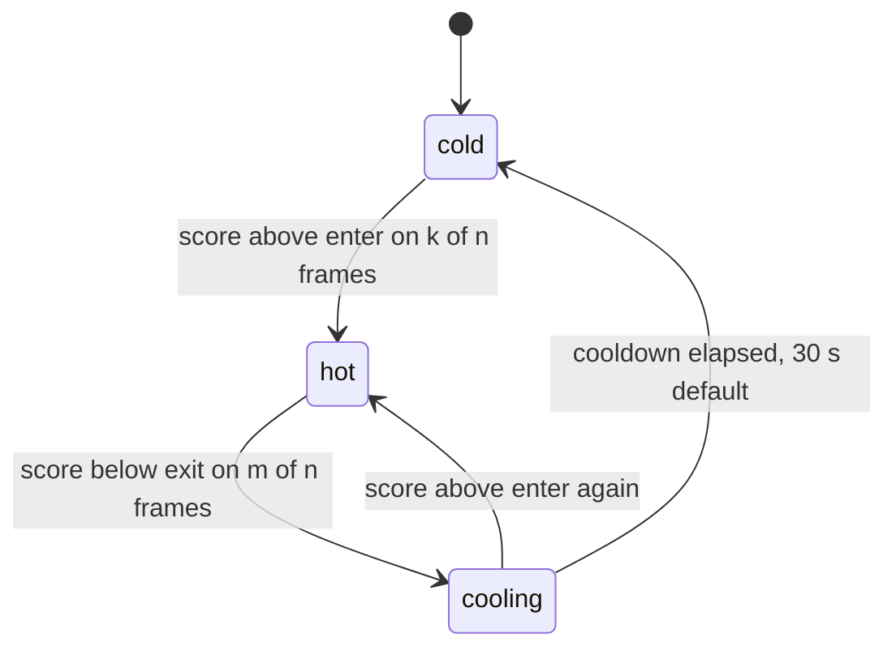

# Tiered Perception Pipeline

Spec for the `perception/*` branches. Built as one PR off `brian-ios`. Source of truth for
every story in the loop; each story cites a section heading below.

**Scope.** Two tiers are added: a *watcher* in front of Gemini and a *decider* behind it.
The clerk splits into the decider, which picks actions, and *writers*, which produce text
only when an action needs it. Short-term hosting is a Mac mini behind a tunnel, so the
watcher gets Apple silicon. Everything below is configuration first: which concepts, what
fires, how often it talks.

Kill switches, all env, all default to today's behaviour when unset: `WATCHER=0`,
`DECIDER=clerk`, `GATE_READS_WATCH=0`, `PUBLISH_ON_LANDING` (exists), `VLM_MAX_IN_FLIGHT`
(exists).

## Baseline

On `brian-ios` head `f910083`, 2026-09-23, this Mac: root `tests/` 130 passed, 2 skipped;
`backend/tests/` 1707 passed; `dashboard` 126 passed, typecheck clean.

## Why this change

Gemini answers the same question 2,400 times an hour, and most of the time the answer is
"nothing changed". The watcher moves that question to a local model that costs nothing per
call. Gemini then runs only when the watcher sees something worth naming.

Today, glasses at 2 fps, one frame per 1.5 s to Gemini:

| Measure | Value | Where measured |
| --- | --- | --- |
| Gemini calls | 2,400 per hour, one per tick | tick interval 1.5 s |
| Call latency p50 | 800 to 1,100 ms | FINDINGS.md corpus runs |
| Tokens per call p50 | 1,250 in, 170 out | tests/test_vlm_tokens.py |
| Ticks with an `ai` block | 62% | 13 Sep live run |
| Notable frame to first spoken word p50 | 9.0 s | 13 Sep live run |

What the watcher changes: attention runs at frame rate and a notable frame is flagged within
one inference of appearing; Gemini becomes event-driven (wake-ups plus a slow heartbeat);
fewer frames leave the Mac; the clerk gains a cheap sense (armed watches run on the watcher);
the tick stays the seam.

## Tiers at a glance

| Role | Was | Runs where | Runs when | Per-call cost | Reads | Writes |
| --- | --- | --- | --- | --- | --- | --- |
| Watcher (new) | nothing | Mac mini, inside the T0 loop | every frame, 2 to 7 fps | 2 to 10 ms, $0 | one JPEG | concept scores, novelty, wake-ups |
| Labeler | T0's Gemini call | Gemini 2.5 Flash-Lite | wake-up, hot mode, heartbeat, look | ~1 s, about $0.0002 | one frame | the §9 `ai` block, unchanged |
| Sensor block | T0 | Mac mini, T0 loop | every tick | ~2 ms | one JPEG | 7 sensor fields, unchanged |
| Decider (new) | the clerk's judgement | Jev | every gate escalation | 70 to 500 ms, about $0.0001 | recent ticks' tags and captions, open episodes, today's summary, persona, trends | one probability per action |
| Writers (new) | the clerk's prose | OpenAI, one prompt per action | only when the decider says yes | 1 to 3 s | the same state plus the chosen action | an insight, a summary line, a hand-off topic, a persona fact |
| Clerk | T1 reasoner | OpenAI | fallback only: Jev down, or a score in the uncertain band | 2 to 3 s | the full envelope | actions, as today |
| Voice agent | third agent | OpenAI + ElevenLabs | on a hand-off | 1 to 3 s | topic and reason | one utterance or question |



The watcher decides when the labeler runs. The decider decides whether anyone writes or
speaks. The tick stays the seam, and nothing downstream of it changes its contract in phase 1.

## Watcher

The watcher is one image-embedding model run on every frame on the Mac, inside the T0 loop,
next to the sensor block. It answers one question per frame: is anything here worth a Gemini
call? It never names things and never speaks.

**Where it runs.** On the Mac in phase 1. The phone stays a dumb adapter, the model is Python
and testable against the replay corpus, and the same code serves a hosted backend.

**Frame supply.** The DAT stream accepts 2, 7, 15, 24 or 30 fps, so "5 a second" means 7 fps
sampled down. Phase 1 keeps the current 2 fps stream and has the phone send every frame
instead of one per 1.5 s. Phase 3 raises the stream to 7 fps. Frames stay 512 px JPEG q70 so
the labeler can reuse them from the ring. The watcher resizes to its own 256 px input.

| Stream | Frames per s | Uplink at ~35 KB per frame |
| --- | --- | --- |
| Today | 0.67 | 23 KB/s |
| Phase 1, 2 fps | 2 | 70 KB/s |
| Phase 3, 7 fps | 7 | 245 KB/s |

**Per frame it computes four things.**

1. An embedding, kept in RAM only. Never in the tick, never on disk, never sent anywhere.
2. Concept scores: cosine similarity against a fixed bank of text prompts, one small group per
   §9 boolean, plus a null group ("an empty desk", "a wall", "a blurry frame"). The prompt
   groups are generated from `ai_fields.py` so the field set still lives in one place. Score
   per concept = max over its prompts, softmaxed against the null group.
3. Novelty: one minus the cosine between this embedding and a 30 s running mean of
   embeddings. Semantic scene change; phash already catches lighting and camera motion.
4. A quality gate from sensor values (sharpness, lux): unusable frames never wake anything.

**When a moment is notable.** Each concept runs a two-threshold hysteresis so a single
flickering frame cannot wake Gemini.



Entering hot issues a wake-up. Re-entering hot from cooling does not, which is what stops a
coffee cup on the desk from waking Gemini all afternoon. A novelty spike above its own
threshold on k of n frames is a wake-up on its own, so things the prompt bank never named
still get looked at. At 7 fps, k of n = 2 of 3 means a wake-up about 300 ms after something
appears. At 2 fps use 1 of 1 with the exit rule doing the debouncing.

**A wake-up carries** the frame ref, the concepts that went hot with their scores, the
novelty value and a reason string. It goes into a one-slot mailbox for the labeler. Newest
wins. Wake-ups inside the same tick coalesce into one.

**Into the tick** it writes one aggregate `watch` block per tick (see Tick). Per-frame values
are not persisted.

**What it never does.** Never blocks the tick (own thread, one-slot input, frames dropped not
queued). Never replaces the `ai` block (a watcher score is a similarity, not a Gemini boolean).
Never triggers an action directly. Never learns online; thresholds are set offline.

**Calibration** is one offline pass. Score corpus frames with the watcher, sweep each
concept's enter threshold for about 90% recall against the Gemini boolean at the lowest
false-wake rate, set exit at roughly two thirds of enter. `tools/probe_watcher.py` does
this. Re-run it after the daylight corpus exists.

### Model

Recommended: MobileCLIP2-S0 (Apple), a zero-shot image-text model. 11.4M image params,
1.5 ms image encoder on an iPhone 12 Pro Max, 71.5% ImageNet zero-shot. S2 (3.6 ms, 77.2%)
is the upgrade path. One forward pass gives every concept score and the novelty embedding;
text prompts are encoded once at start. Licence `apple-amlr`: confirm terms before an outside
tester; SigLIP 2 (Apache-2.0) is the swap. A CLIP score is a similarity, not a calibrated
probability, and it cannot count or localise; that is why the labeler still exists.

## Labeler

Gemini keeps its prompt, its schema and its `ai` block. What changes is when it runs. Four
reasons start a call, in priority order, through one one-slot mailbox where the newest
request of the highest priority wins.

1. **Wake-up.** The watcher flagged a concept or a novelty spike. The call labels the newest
   frame, not the flagged one.
2. **Hot mode.** While a concept is in transition (the first 60 s after it goes hot and the
   30 s cooling window) the labeler runs at today's cadence, one call per 1.5 s. In steady hot
   state it drops to one call per 10 s (see Gate and actions).
3. **Heartbeat.** One call every 60 s when idle. Refreshes `scene` and `activity`, catches
   what the prompt bank never named, keeps the `change` trigger alive, proves health.
4. **Targeted look.** The clerk's `look` action asks one question of the current frame. The
   §9 prompt gains one extra question and the response one short `answer` string.

**Budget and overlap.** Reuse the existing tagger: two calls in flight, no cancel at the
budget, a 3 s ceiling, results attached only while inside the gate's freshness window,
publish-on-landing.

**Cost ceiling.** `LABELER_MAX_PER_HOUR`, default 600. Past the cap, hot mode stops and only
wake-ups and the heartbeat run.

| Mode | Calls per hour | Cost per hour |
| --- | --- | --- |
| Today, every tick | 2,400 | $0.46 |
| Idle, heartbeat only | 60 | $0.01 |
| Typical hour, 10 wake-ups and 10 min hot | 470 | $0.09 |
| At the cap | 600 | $0.12 |

**How results land.** Unchanged. `as_of`, `age_ms`, consume-once, absent rather than stale.
A heartbeat result looks exactly like any other `ai` block. The reason a call ran is in the
tick's `watch` block, so `ai` stays byte-identical to today.

**When Gemini fails**, the tick goes out without `ai`, exactly as today. After five
consecutive errors the heartbeat backs off to every 5 min; wake-ups still try.

## Tick

The tick gains one optional block, `watch`, and nothing else moves. Cadence stays 1.5 s in
phase 1. Frames arrive faster than ticks now; the watcher scores each one and the tick carries
the aggregate.

```json
{
  "v": 1, "tick_id": "t_00001234", "t": 1758540000.0, "seq": 1234,
  "sensor": { "lux_proxy": 0.42, "cct": 4100, "hist_spread": 0.31, "frame_delta": 0.02, "flow_mag": 0.1, "sharpness": 0.6, "phash": "a3f1..." },
  "device": { "accel_rms": 0.03, "gps_speed": null },
  "watch": {
    "v": 1, "model": "mobileclip2-s0",
    "frames": 10, "usable": 9,
    "scores": { "food_present": 0.71, "caffeine_visible": 0.12, "screen_present": 0.05, "people_present": 0.02 },
    "novelty": 0.34,
    "hot": ["food_present"],
    "woke": "food_present"
  },
  "ai": { "food_present": true, "scene": "kitchen", "as_of": 1758539999.6, "age_ms": 400 },
  "frame_ref": "t_00001234"
}
```

| Block | Present when | Changed |
| --- | --- | --- |
| `sensor` | always | no |
| `device` | glasses adapter only | no |
| `watch` | watcher enabled; absent under replay or webcam without it | new |
| `ai` | a labeler result landed inside the freshness window | no |
| `frame_ref` | always; the last frame of the tick | no |

`scores` is keyed by the §9 boolean field names. `frames` and `usable` say how much evidence
the tick had. `hot` lists concepts in the hot or cooling state at tick end. `woke` names the
wake-up issued in this tick, or is null.

Rules for the downstream side: tolerate `watch` absent; never read a `watch` score as a §9
boolean (phase 1 does not read it at all); absent `ai` now mostly means nothing was worth a
call, so the health rule on AI coverage is replaced by heartbeat age and wake-up latency; the
pydantic `Tick` model must accept the new key; the mirrors record `watch` per tick.

**The ring.** At 7 fps a 90 s ring is about 630 frames and 22 MB. The frame cap of 256 must
rise to match. Frames still never touch disk.

## Gate and actions

Phase 1 changes nothing downstream. Phase 3 lets the gate read the watcher for persistence
and gives the clerk cheap new moves.

**Sustained states are the catch.** Screen time, a conversation or an outdoor walk keeps a
concept hot for an hour. So the labeler cadence follows the concept's state.

| Concept state | Labeler cadence | Why |
| --- | --- | --- |
| Transition: first 60 s of hot | 1 call per 1.5 s | sustained triggers need their hits inside 60 s (screen: 20 hits in production) |
| Steady hot | 1 call per 10 s | keeps episodes open; 10 s is far under the 80 s silence rule that closes one |
| Cooling: 30 s after leaving hot | 1 call per 1.5 s | episodes close on real Gemini misses, as today |
| Cold | heartbeat, 60 s | change trigger and enums stay fresh |

Point-sighting concepts (caffeine, alcohol, smoking, medication) get no steady-hot cadence:
after the transition window they are spent until they go cold and re-enter. An hour of screen
time costs about 420 calls instead of 2,400.

**Phase 3: the labeler confirms what, the watcher proves how long.** Behind
`GATE_READS_WATCH=1`, sustained triggers become: concept score above enter on most ticks in
the window, and at least one confirming `ai` boolean in the same window. Episodes exit on
labeler misses or on the concept going cold for the exit window, whichever first. Point
sightings stay labeler-only. Novelty joins the `change` trigger. Once in, steady hot cadence
can fall to one call per 30 s.

**Actions.** Eight exist on `brian-ios`: seven from the clerk plus Lukas's `act`.

| Action | Status | Fields | Effect |
| --- | --- | --- | --- |
| `annotate` | keep, still mandatory | line | one line into today's summary |
| `log_insight` | keep | category, text | a report metric |
| `remember` | keep | line | a persona fact |
| `speak` | gains `deliver` | text, urgency, deliver | hand-off to the voice agent, statement mode |
| `ask` | gains `deliver` | text, answer_kind, fills, deliver | hand-off, question mode |
| `watch` | extended | after_s, condition, plus `concept`, `within_s` | a timed recheck, or an armed watcher condition |
| `act` | Lukas's | id, kind, args | the phone does one thing: calendar block, app shield, and now a sound cue |
| `look` | new | question, reason | one targeted labeler call on the current frame |
| `nothing` | keep | | |

**`watch` with a concept** arms the watcher: "wake me if `screen_present` goes hot within
600 s". On a match the gate escalates with reason `watch_armed` and the original decision id.

**`look`** asks one question of the current frame through the labeler's mailbox. The answer
re-wakes the decider with the question and answer appended. One look per decision, never
chained. If a conversation is open, the answer goes to the voice agent instead.

**A sound cue is an `act` kind**, not a new action: `act {kind: sound, args: {name: chime |
tick | soft}}`. Its own hourly limiter; a sound next to a `speak` in one decision keeps only
the speak.

**`deliver`** stops the voice agent talking over a conversation. `now` (default for high
urgency); `quiet` waits up to `quiet_max_s` for a tick where `people_interacting` is cold,
`activity` is not talking and the device is not moving fast, else drops; `expire_s` drops if
not delivered by then. Enforced in the voice agent's open step against the newest tick's
`watch` block.

**Normalisation additions.** At most one `look` per decision; a `look` defers that decision's
`speak` and `ask` until the answer is back. Everything else in `normalize()` stays: annotate
always, ask beats speak, nothing dropped when anything else exists.

## Decider and writers

The clerk's one slow call becomes a fast decision and, only when needed, a small write.

**The decider is Jev**, TypeSafe's classifier: text in, calibrated probabilities out,
70 to 500 ms, $0.042 per million input tokens, output free. Endpoint
`POST https://api.typesafe.ai/v1/systemone`, bearer auth; Python SDK `typesafe-sdk` whose
models are generated from the API's OpenAPI spec. `state` may be a JSON object. It cannot see
a frame, so its state is text the pipeline already holds: the last few ticks' tags and
captions, the open episodes, today's summary, the persona, the seven-day trends. One request
carries every question below; answers come back under the same keys.

| Question | Type | Threshold knob |
| --- | --- | --- |
| Write a line into today's summary? | yes/no (noul) | always fires; kept so the wording is logged |
| Log an insight? | noul | `DECIDE_LOG_INSIGHT` |
| Remember a lasting fact? | noul | `DECIDE_REMEMBER` |
| Recheck later? | noul | `DECIDE_WATCH` |
| Say something? | noul | `DECIDE_SPEAK` |
| Ask the wearer? | noul | `DECIDE_ASK` |
| Act on the phone? | noul | `DECIDE_ACT` |
| Look closer at the frame? | noul | `DECIDE_LOOK` |
| Which topic? | choice over the persona's topics | none; the top choice is the writer's topic |
| How urgent? | score, low to high | maps to `deliver` |

Each action whose probability clears its threshold fires, and `normalize()` resolves
conflicts as it does today. Thresholds live in config, one per action.

**Fallback.** A score for `speak`, `ask` or `act` inside the uncertain band, 0.4 to 0.6 by
default, hands the whole decision to the old clerk, and so does any Jev error. The clerk is
never deleted.

**Writers** are small GPT prompts, one per action, that run only on a yes: an insight writer,
a summary-line writer, a persona writer, a hand-off writer for speak and ask, a question
writer, a watch-condition writer, a look-question writer. Each gets the same state plus the
chosen action and topic, and returns one field. The decision row records which path decided
and which writers ran.

**Unverified as of 22 Sep 2026.** Jev closed signups that day, so no key exists. The client is
written from the documented schema with a fake for tests; latency and calibration get checked
the day a key arrives.

## Edge cases

| Situation | What happens | Rule |
| --- | --- | --- |
| A cup passes through the frame for one frame | no wake-up | k of n hysteresis plus the null prompt group |
| Wake-up not confirmed by the labeler | logged as a false wake | that concept's re-wake cooldown doubles, 30 to 60 to 120 s, capped; a confirmed wake resets it |
| Something the prompt bank never named | seen within 60 s at worst | novelty wake-up; the heartbeat bounds the rest |
| Coffee cup on the desk all afternoon | 40 calls once, then nothing | point-sighting concepts get no steady-hot cadence |
| Walking into a café: several concepts fire at once | one labeler call | wake-ups inside the same tick coalesce; `woke` names the first, `hot` lists the rest |
| Dark room, lens covered, motion blur | `usable: 0`, no wake-ups | quality gate; heartbeat slows to 5 min |
| Glasses on the table, still and unchanging | dormant | after 5 min with no hot concept and flat novelty the heartbeat drops to 5 min; any novelty ends dormancy |
| Watcher falls behind | frames dropped, never queued | one-slot input; `frames` per tick shows the shortfall; alarm when usable under half of expected for 30 s |
| First inference after start takes seconds | no effect on ticks | warm-up frame and text bank encoded before the loop starts |
| Hourly labeler cap reached | hot mode off | wake-ups and heartbeat only; status shows capped |
| Gemini down or slow | ticks without `ai`, as today | watcher unaffected; heartbeat backs off after five errors |
| Clerk wants to speak mid-conversation | held or dropped | `deliver: quiet` |
| Publish-on-landing re-sends a tick | one tick, not two | the `watch` block is set at assembly and unchanged on the re-send |
| Too many armed watches | oldest evicted | at most 8 armed at once, each with `within_s` |
| Night-only calibration | outdoor and daylight thresholds are guesses | rerun the sweep on the daylight corpus |
| Replay and webcam sources | watcher runs on them too | `watch` is absent only when the watcher is switched off |

**Privacy improves and becomes measurable.** Embeddings live in RAM and die with the process.
A frame leaves the Mac only for a wake-up, a transition, a heartbeat or a look. Frames sent
per hour becomes a number on `/api/status`.

## Phases

| Phase | What lands | Switch back |
| --- | --- | --- |
| 0. Measure | calibration tool; recall and false-wake rate per concept; inference ms | none needed |
| 1. Watcher on the Mac mini | phone sends every 2 fps frame; `watcher.py`; `watch` block; labeler modes, heartbeat, cap; health rules; `Tick` accepts `watch` | `WATCHER=0` |
| 2. Decider and writers | Jev client with a fake; one yes/no per action; thresholds in config; writers; uncertain-band fallback; decision path recorded | `DECIDER=clerk` |
| 3. Faster and smarter | 7 fps; ring cap; gate reads `watch`; episodes exit on cold; `look`, `deliver`, armed `watch`, sound `act` | `GATE_READS_WATCH=0` |
| 4. Optional | phone-side watcher | not built until its decision rule says so |

## What to measure

| Metric | Today | Target |
| --- | --- | --- |
| Labeler calls per idle hour | 2,400 | 100 or fewer |
| Labeler calls per hour of screen time | 2,400 | 500 or fewer |
| Clerk calls per escalation | every one | fallback only, under 1 in 10 |
| Notable frame to first spoken word, p50 | 9.0 s | 4 s or under |
| Wake-ups confirmed by the labeler | not measured | 70% or more |
| Recall of Gemini booleans on the corpus | not measured | 90% or more per concept |
| Watcher inference on the Mac mini, p50 and p99 | not measured | 10 ms and 30 ms |
| Frames leaving the Mac per idle hour | 2,400 | 100 or fewer |
| Frames dropped by the watcher | not measured | under 5% |

## Status

- Watcher: not started.
- Decider and writers: built on `perception/decider` (US-D01 to D08): settings, state builder, Jev client with a fake, writers, decision path columns, reasoner routing with clerk fallback, factory, sound act. Built against the documented API and the SDK's OpenAPI models; the real Jev client is unverified until a key exists (signups closed 22 Sep 2026). Verifier 2026-09-23: root 130, backend 1823, dashboard 126, all green.
- Phase 3: not started.

Sources: MobileCLIP README (github.com/apple/ml-mobileclip), MobileCLIP2-S0 model card
(huggingface.co/apple/MobileCLIP2-S0), Gemini API pricing (ai.google.dev/gemini-api/docs/pricing),
TypeSafe docs (docs.typesafe.ai) and `typesafe-sdk` 0.7.1 on PyPI.
